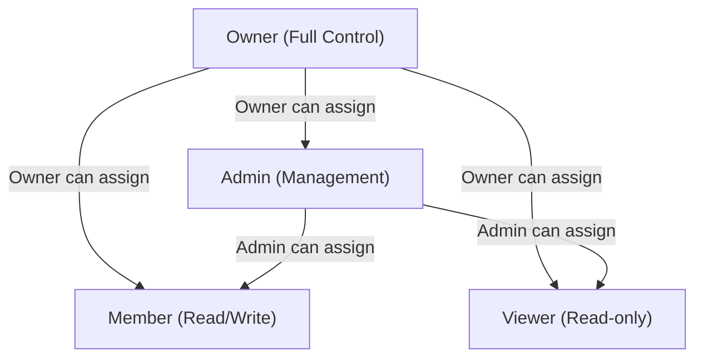

# Team Member Roles & Management

## Permission Matrix

Programmatic source of truth: See [features/teams/constants.ts](../constants.ts).

| Can Assign To / Caller | Viewer | Member | Admin | Owner |
| ---------------------- | :----: | :----: | :---: | :---: |
| Owner                  |  Yes   |  Yes   |  Yes  |  Yes  |
| Admin                  |  Yes   |  Yes   |  No   |  No   |
| Member                 |   No   |   No   |  No   |  No   |
| Viewer                 |   No   |   No   |  No   |  No   |

Legend:

- Yes = Caller (row) can assign to target role (column)
- No = Not allowed

### Role Assignment Rules

- Admins can only assign Member or Viewer roles
- Owners can assign any role
- Members and Viewers cannot manage others
- No one can demote the Owner
- Admins cannot change other Admins' roles

---

## Role Transition Diagram



---

## Role Hierarchy & Permissions

### Owner

**Highest privilege level** - Exclusive role (one per team)

**Can:**

- View, create, edit, and delete all songs and playlists
- Invite members with any role
- Change any member's role (except owner)
- Remove any member from the team
- Transfer team ownership to another member
- Delete the entire team

**Cannot:**

- Be removed from the team (must transfer ownership first)

---

### Admin

**Management level** - Multiple admins allowed

**Can:**

- View, create, edit, and delete songs and playlists
- Invite members (but only as Member or Viewer)
- Change member roles (but only to Member or Viewer, not Admin or Owner)
- Remove Members and Viewers from the team

**Cannot:**

- Remove other Admins or the Owner
- Promote members to Admin or Owner
- Transfer team ownership
- Delete the team

---

### Member

**Full content access** - Standard team member

**Can:**

- View, create, and edit songs and playlists
- Full read/write access to team content

**Cannot:**

- Delete songs or playlists (Admin+ required)
- Manage team members (invite, remove, change roles)
- Access team settings
- Manage the team itself

---

### Viewer

**Read-only access** - Minimal permissions

**Can:**

- View team songs and playlists

**Cannot:**

- Create, edit, or delete anything
- Manage team members
- Access team settings
- Modify any team content

---

## Member Management Features

### Invite Members

- **Who can invite:** Owner and Admin
- **Invitation method:** Email-based with 7-day expiration
- **Role assignment:** Can assign Member, Admin, or Viewer roles at invitation
- **Restrictions:** Admins can only invite as Member or Viewer

### Change Member Roles

- **Who can change:** Owner (all roles), Admin (Member/Viewer only)
- **UI:** Dropdown menu on each member card
- **Available roles:** Viewer, Member, Admin (Owner cannot be changed)
- **Protection:** Cannot change own role or Owner's role

### Remove Members

- **Who can remove:** Owner (all members), Admin (Member/Viewer only)
- **UI:** Dropdown menu with confirmation dialog
- **Protection:** Cannot remove yourself or the Owner
- **Warning:** Removed members need to be re-invited to rejoin

---

## Implementation Details

### Database Functions (RPC)

- `invite_team_member()` - Create invitation with email and role
- `remove_team_member()` - Remove member with permission checks
- `change_team_member_role()` - Update member role with hierarchy validation

### React Hooks

- `useInviteTeamMember()` - Handle member invitations
- `useRemoveTeamMember()` - Handle member removal
- `useChangeTeamMemberRole()` - Handle role changes

### UI Components

- **InviteMemberDialog** - Email and role selection form
- **TeamMembersSection** - Member list with action dropdowns
- **AlertDialog** - Removal confirmation with warnings

---

## Security & Validation

### Row Level Security (RLS)

All operations enforce permissions at the database level through RLS policies:

- Songs: Members can create/edit, **Admins+ can delete**
- Playlists: Members can create/edit, **Admins+ can delete**
- Team settings: Only Owners can modify

### Permission Hierarchy

```
owner > admin > member > viewer
```

Operations check both:

1. **Caller's role** - Must have sufficient privileges
2. **Target's role** - Cannot affect users at same or higher level (except Owner)

### Activity Logging

All member management actions are logged to `activity_log`:

- team_member_invited
- team_member_removed
- team_member_role_changed
